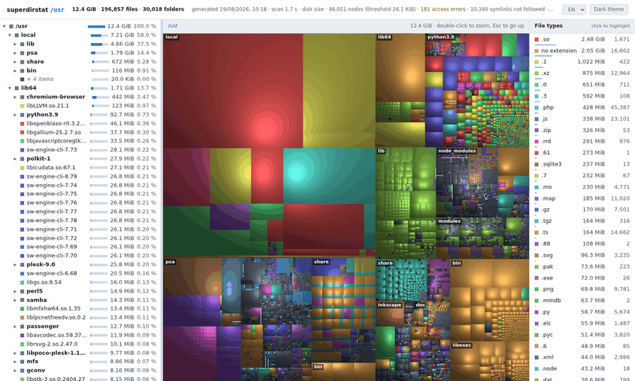
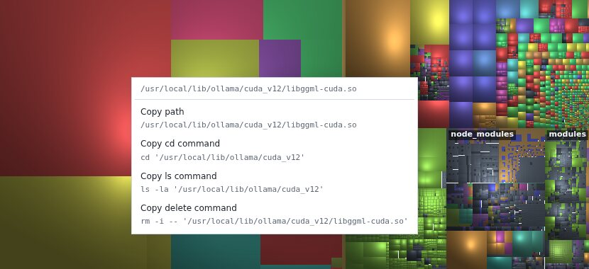

# superdirstat

WinDirStat alternative for Linux, as a single file that writes a single file.

```sh
./superdirstat.py /usr report.html
```

You get one self-contained HTML report — a squarified treemap with cushion shading next
to a synchronised file tree — that you can open with `file://`, keep, or email. No
server, no build step, no dependencies.

It scales to a whole server: **12.1 million files over 3.35 TiB, scanned in 105 seconds
into a 1.6 MiB report** — about 115,000 files a second, with no index, no daemon and
nothing left running afterwards.



## Why this exists

`ncdu`, `gdu` and `dust` are excellent, and they live in your terminal. `filelight` and
`qdirstat` draw the map you want, and they need a desktop session. Neither gives you an
**artefact**: a file you can produce over SSH on a headless box, open a week later, or
send to someone who will not install anything.

That is the whole point of this tool. The Python side only walks the tree; the browser
does the drawing.

## Install

Requires Python 3.7+ (developed and tested on 3.9). Nothing else — the standard library
does the scan.

```sh
curl -O https://raw.githubusercontent.com/DanXk/superdirstat/main/superdirstat.py
chmod +x superdirstat.py
./superdirstat.py ~/Downloads report.html
```

Or, for a `superdirstat` command on your PATH:

```sh
pipx install superdirstat
```

## Usage

```
superdirstat [options] path [output]
```

| Option | What it does |
| --- | --- |
| `--apparent` | Use apparent size (`st_size`) instead of real disk usage |
| `-x`, `--one-file-system` | Do not cross mount points |
| `-e GLOB`, `--exclude GLOB` | Skip entries matching this glob, tested on both name and full path (repeatable) |
| `--max-nodes N` | Maximum nodes in the report (default 80000) — this is what governs the file size |
| `--min-share RATIO` | Aggregation threshold as a fraction of the total (default 2e-6, about two pixels) |
| `--min-file BYTES` | Aggregate files below this size during the scan, to save memory on huge trees |
| `--include-pseudo` | Include `/proc`, `/sys`, `tmpfs`… (skipped by default) |
| `-q`, `--quiet` | No progress output |

Scanning `/` is a supported, ordinary case:

```sh
sudo ./superdirstat.py / root.html
# Scanned in 13.1 s: 1,258,492 files, 229,951 folders, 87.4 GiB
# Report: root.html (1.96 MiB, 70,075 nodes)
```

## Reading the report

- **Treemap** — one rectangle per file, area proportional to size, colour by extension.
  Cushion shading (van Wijk) is what makes the nesting readable rather than a flat
  mosaic. Hover for the full path, click to select, double-click a folder to zoom,
  `Esc` to go back up.
- **File tree** — sizes, share of the parent, share of the total. Hovering a row
  outlines the matching rectangles; hovering a *folder* outlines its whole region.
- **File types panel** — every extension with its size and file count. Click one and
  the rest of the map fades out, leaving only the squares of that type. `Esc` clears it.
- **Right-click menu** — on a rectangle or a tree row, copies a shell command for that
  entry: its path, `cd` or `ls -la` on the folder holding it, and for a file, `rm -i --`
  on it. A folder offers a rescan of itself and a `find` of its largest files instead.
  Each entry displays the command it copies, and nothing is ever run by the report.
- **Theme and language** — light or dark, English or French, both remembered. The
  language selector rewrites the interface only; nothing is re-scanned.




## Things worth knowing

**Sizes are disk usage, not file length.** `st_blocks * 512`, like WinDirStat, so a
sparse or tiny file costs what it really costs. `--apparent` switches to `st_size`.

**A folder's own blocks are shown.** A directory entry occupies disk too, and that space
belongs to no child. It appears as a *folder overhead* leaf, because leaving it out lets
children share an area larger than their real sum — worth up to 17 % of distortion on
deep, mostly-empty trees.

**The tree is pruned, and the report says so.** Everything too small to be visible is
folded into a `+ N items` leaf; the threshold rises automatically until the node count
fits under `--max-nodes`. The header states the resulting threshold. Without this, a
scan of a few million files produces a payload no browser will open.

**Virtual filesystems are skipped.** `/proc`, `/sys`, `tmpfs` and friends occupy no
disk. Their mount points are read from `/proc/self/mountinfo` rather than hard-coded,
because the real list depends on the machine — containers, cgroup v1 vs v2, bind mounts.

**Symlinks are never followed; hardlinks are counted once.** A symlink's own blocks are
counted where the link sits, as `du` does — what is not done is walking through it. Both
counts appear in the header, so a total that differs from another tool is explainable
rather than mysterious.

**Depth is capped at 2048 levels.** No real path goes that deep — PATH_MAX runs out
first, at roughly 2000 levels of single-letter directory names — so this only ever fires
on a tree something has mangled. When it does, the folders left out are counted in the
header instead of taking the scan down with them.

## Performance

On a busy server, cold cache excluded:

| Tree | Scan | Report | Render in browser |
| --- | --- | --- | --- |
| 221k files, 9 GiB | 2.1 s | 1.9 MiB | 37 ms |
| 1.26M files, 87 GiB | 13.1 s | 2.0 MiB | 40 ms |
| 12.1M files, 3.35 TiB | 105.6 s | 1.6 MiB | not measured |

That works out at 115,000 files a second, or 136,000 directory entries counting folders,
from a single process with no threads: one `readdir` batch per directory and one `stat`
per entry, which is the least the sizes can be known from. Tools that thread the walk
overlap those same calls and can beat it on wall clock; this one buys its speed by not
doing anything else. The last row was scanned on a different machine, so its render time
is missing; it holds fewer nodes than the row above it, which bounds it.

**Memory is the limit to watch, not time.** The whole tree is held before pruning, at
roughly 300 bytes per entry — 65 MB for 220,000 entries, and close to 4 GB for the 14.4
million of that 3.35 TiB scan. `--min-file 65536` aggregates small files during the walk
when that does not fit, at the cost of detail on them.

## Tests

The report's JavaScript can be checked without a browser:

```sh
./superdirstat.py /usr /tmp/r.html
node tests/geometry.js  /tmp/r.html    # exact tiling, proportional areas, hit-testing
node tests/highlight.js /tmp/r.html    # the type filter, pixel by pixel
node tests/bench.js     /tmp/r.html    # layout / paint / highlight timings
node tests/context.js   /tmp/r.html    # the commands the right-click menu copies
```

See [tests/README.md](tests/README.md) — in particular the reason those tests compile
the report with `vm.runInThisContext` and never `eval()`.

## Limitations

- **Linux only.** `st_blocks` and `/proc/self/mountinfo` are the two hard dependencies.
  macOS would need a different mount enumeration; `--apparent` works anywhere.
- **Read-only by design.** No delete, no move — the right-click menu composes commands
  and puts them on the clipboard, it never executes anything, and only a file is ever
  offered a delete command. A tool that draws your disk and a tool that empties it should
  not be the same binary.
- **A report is a snapshot.** There is no watching, no diffing between two reports yet.

## License

MIT — see [LICENSE](LICENSE).

The cushion shading comes from Jarke van Wijk and Huub van de Wetering's *Cushion
Treemaps* (1999), by way of WinDirStat and KDirStat. The implementation here is
independent.
